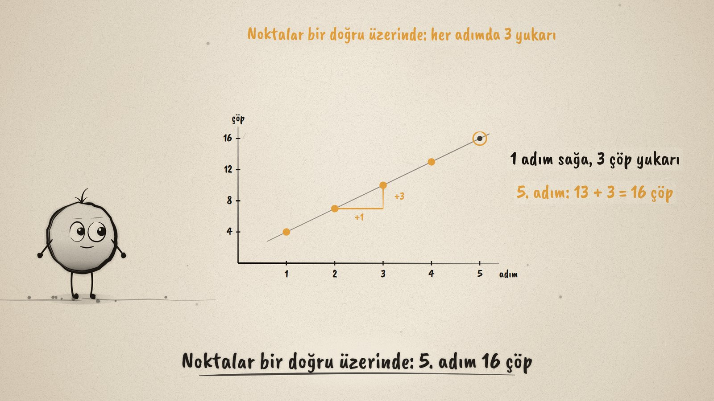
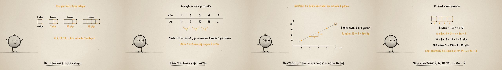

# Kibrit Kareler · Number and Shape Patterns

**▶ Tarayıcıda izleyin / Watch in the browser:** https://hakanatas.github.io/kibrit-kareler/ 
**⬇ MP4 + altyazılar / MP4 + subtitles:** [Releases](https://github.com/hakanatas/kibrit-kareler/releases) 
**✎ Kullanılan istem / The prompt behind it:** [PROMPT.md](PROMPT.md) 
**🎞 Bütün filmler / All films:** [Nokta'nın Filmleri](https://hakanatas.github.io/nokta-filmleri/?sinif=6)

> **TR —** 6. sınıf matematik "İşlemlerle Cebirsel Düşünme ve Değişimler" temasındaki MAT.6.2.2 öğrenme çıktısı için hazırlanmış, tamamen JavaScript ile çizilen 92 saniyelik mürekkep animasyonu. Kibrit çöpleriyle yan yana kareler kuruluyor: 4, 7, 10, 13 çöp. Her yeni kare 3 çöp ekliyor, çünkü bir kenarı öncekiyle ortak. Aynı örüntü dört temsille gösteriliyor: tablo (adım 1 artınca çöp 3 artar), sözel anlatım, grafik (noktalar bir doğru üzerinde: 1 sağa, 3 yukarı; 5. adım 16 çöp) ve cebirsel ifade: baştaki 1 çöp ve her kare için 3 çöp, yani 3n + 1. Bununla 10. adım (31) ve 100. adım (301) çizmeden bulunuyor; bir sayı örüntüsü de (2, 6, 10, 14 → 4n − 2) aynı yolla yazılıyor. Altyazılar Türkçe, İngilizce ya da ikisi birlikte seçilebilir.

A 92-second ink animation for **6th-grade maths**. Nokta, the ink character from [The Learning Ink](https://github.com/hakanatas/the-learning-ink), is the guide again. The matchstick figures are generated, not drawn by hand: `sticks(n, …)` in `src/draw/film.js` lists the lone first stick and three sticks per square, which is exactly the structure behind 3n + 1, and the same list colours the groups in the last scene.

## Learning outcome

MEB, Türkiye Yüzyılı Maarif Modeli, Ortaokul Matematik, 6th grade, "İşlemlerle Cebirsel Düşünme ve Değişimler" theme:

**MAT.6.2.2. Sayı ve şekil örüntülerini yorumlayabilme**
- a) Sayı ve şekil örüntülerindeki ilişkileri inceler.
- b) İncelediği ilişkileri tablo, grafik ve sözel temsiller aracılığıyla ifade eder.
- c) Farklı temsillerle gösterilen ilişkilerden yola çıkarak örüntülerdeki yapıları cebirsel olarak ifade eder.

## Scenes

| # | Time | Scene | What happens | Outcome |
|---|---|---|---|---|
| 1 | 0–10 s | Kibritler | One square takes 4 sticks; how many for two? | a |
| 2 | 10–30 s | Şekil örüntüsü | Steps 1–4: 4, 7, 10, 13 sticks; each new square adds 3. | a |
| 3 | 30–46 s | Tablo ve söz | Step and sticks in a table with +3 hops; the rule in words. | b |
| 4 | 46–62 s | Grafik | Points on a line, 1 right and 3 up; step 5 predicted at 16. | b |
| 5 | 62–80 s | Cebir | 1 + 3 × n = 3n + 1; steps 10 and 100; the number pattern 2, 6, 10, 14 as 4n − 2. | c |
| 6 | 80–92 s | Aklında kalsın | Figure, table, graph, words and algebra. | a–c |

## Running it

- **Preview:** double-click `index.html` (it works offline).
- **MP4:** run `npm install` once, then `npm run export -- --format=horizontal --captions=tr`.
- **Subtitles and narration:** `npm run srt` writes `out/captions_*.srt` and `narration_notes.txt`.
- **Editing:**
  - Caption text, timings and narration notes: `captions.js`
  - Everything on screen is drawn by `LI.world(t)` in `scenes/scene1.js` (the steps, the table, the graph, the expression); the other scenes only set the camera.
  - Matchsticks and figures, fractions and Nokta's poses: `src/draw/film.js`; layout for 16:9 and 9:16: `src/draw/kd.js`

It uses the same engine as The Learning Ink: `renderFrame(t)` as a pure function of time, seeded randomness, and frame-by-frame export.
